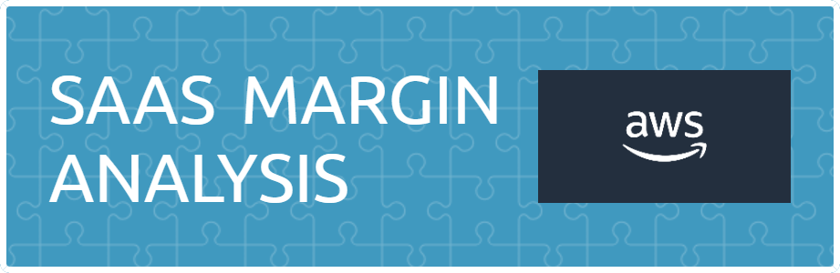

## Latar Belakang
AWS merupakan perusahan yang merupakan bagian dari Amazon yang berfokus pada penyediaan teknologi cloud terdepan di dunia yang membantu setiap organisasi dan individu membangun solusi untuk mengubah industri, dan komunitas menjadi lebih baik. AWS menawarkan produk salah satunya yaitu SaaS. **SaaS** memungkinkan penggunaan aplikasi perangkat lunak sebagai layanan kepada pengguna akhir. Contoh Software-as-a-Service (SaaS) antara lain Adobe, Google, Salesforce, Cisco, SAP, Microsoft, dan Oracle 

perusahaan aws sedang melakukan evaluasi tahunan terhadap penjualan mereka, hal ini mencakup penjualan, profit, dan margin profit. pada evaluasi tahun 2023 terjadi penurunan profit margin yang dimana hal ini dapat mempengaruhi keuangan perusahaan.

## Pernyataan masalah
Perusahaan ingin mengetahui faktor apa saja yang menyebabkan penurunan profit perusahaan agar pada tahun selanjutnya perusaaan dapat memperbaiki permasalahan tersebut sehingga tidak terjadi lagi penurunan margin tersebut.

## Link Notebook
untuk melihat file jupyter notebook dengan grafik klik link berikut [Link](https://nbviewer.org/github/habibjafar08/SAAS-Profit-Margin-Analysis-/blob/main/Notebook/cap2.ipynb)
## Link Tableau
Untuk melihat dashboard klik link berikut [link](https://public.tableau.com/app/profile/habib.jafar.nuur/viz/caps2final/Dashboard2?publish=yes).

## PROJECT ORGANIZATION

Strutur dari project analisis ini yaitu:

├── README.md <- Menampilkan latar belakang dan pernyataan masalah yang harus dijawab.
├── docs <- dokumen berisi presentasi dari dari hasil analisis.
├── Notebook <- berisi hasil analsis berbentuk file .ipynb .
└── requirements.txt <- The requirements file untuk memproduksi analysis environment, e.g. generated with `pipreqs > requirements.txt`
